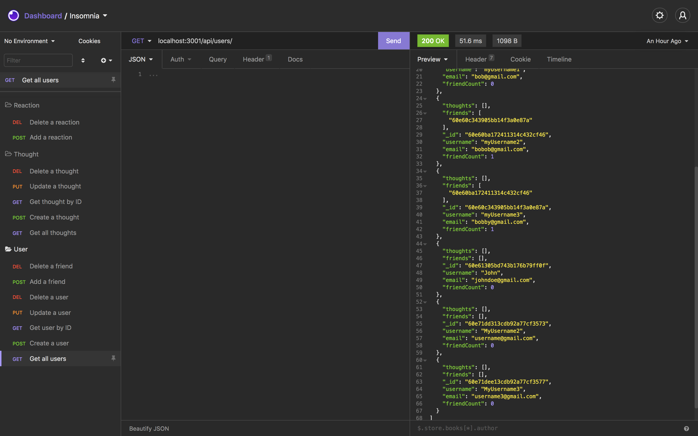

# NOSQL: Social Network API

  ## Desciption 
  This application creates an API for a social network where users can share their thoughts, react to friends' thoughts and create a friends list. The application is built with Express.js, MongoDB, and JavaScript. A walkthrough video demonstrating the appilication is linked below.
  
  [Walkthorugh](https://drive.google.com/file/d/1y3tnIQEIIAHeCj5tLCOfKzMRdDT25eUr/view?usp=sharing)

  ## Table of Contents
  - [Installation](#installation)
  - [Usage](#usage)
  - [Questions](#questions)

  ## Installation 
  npm i , npm start

  ## Usage 
  Test routing in Insomnia

  ## Tests 
  Run routes in Insomnia

  ## Questions 
  If you have any questions reach out to me at:  
  Github: https://github.com/Landonwilson1  
  Email: Landonjwilson1@gmail.com
  
  ## Screenshot
  
  
  

  
